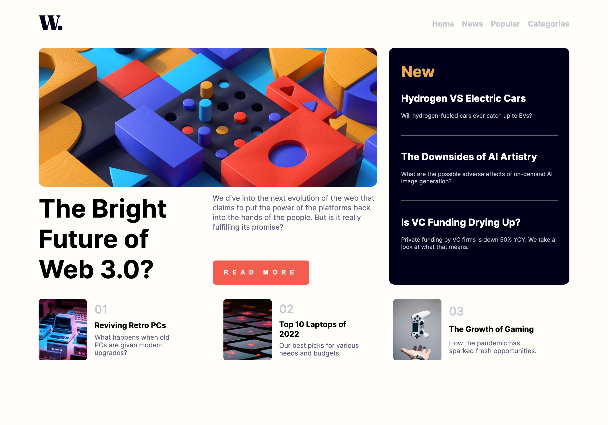

# Frontend Mentor - News homepage solution

This is a solution to the [News homepage challenge on Frontend Mentor](https://www.frontendmentor.io/challenges/news-homepage-H6SWTa1MFl). Frontend Mentor challenges help you improve your coding skills by building realistic projects.

## Table of contents

- [Overview](#overview)
  - [The challenge](#the-challenge)
  - [Screenshot](#screenshot)
  - [Links](#links)
- [My process](#my-process)
  - [Built with](#built-with)
  - [What I learned](#what-i-learned)
  - [Continued development](#continued-development)
  - [Useful resources](#useful-resources)
- [Author](#author)
- [Acknowledgments](#acknowledgments)

**Note: Delete this note and update the table of contents based on what sections you keep.**

## Overview

### The challenge

Users should be able to:

- View the optimal layout for the interface depending on their device's screen size
- See hover and focus states for all interactive elements on the page

### Screenshot

### Links

- Solution URL: [Add solution URL here](https://your-solution-url.com)
- Live Site URL: [Add live site URL here](https://your-live-site-url.com)

## My process

This took me a bit of time, and a couple of attemps.

On the final attempt that led to this semi-successful output, I started off with navigation - both desktop and mobile. I really wanted to understand how to build the hamburger nav with HTML, CSS and JS.

Afterwards I structured the main sections. Building out HTML was pretty straightforward, although I had to go back and forth between CSS and HTML to add/or remove unnecessary classes.

Navigation is defnitely a stronger element in this challenge as I closely followed a tutorial linked in the last section.

Definitelt eye-balling a lot of measurements and using percentages.

### Built with

- Semantic HTML5 markup
- CSS custom properties
- Flexbox
- JS
- Mobile-first workflow (sort-off)

### What I learned

I learned how to create a hamburger nav with CSS/JS. Definitely will take a few more projects to nail it.

### Continued development

Still struggling to understand how to use flexbox elements and make them responsive in the way I want them to appear, failing to fully comprehend widths/heights of flex items and how values are inherited. This is a goal for the next project.

## Acknowledgments

This video was key for nav: url (https://www.youtube.com/watch?v=HbBMp6yUXO0).
